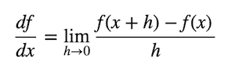
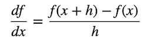

# Finite Difference Exercise

In this exercise, we will approximate derivatives with Python. In order to do this, we need to recall the formula for the derivative from first principles, which is the definition of the derivative.

While it isn't easy to simplify algebraic expressions involving limits using Python, we could obtain an estimate for the value of the derivative by calculating the expression on the right hand side for small values of h. 

Lets code this formula into a function which takes as its inputs:
* f - the function whose derivative we wish to approximate
* x - the value at which we wish to approximate the derivative
* h - the value of the difference in the formula

and outputs an approximation for the derivative using the formula:



